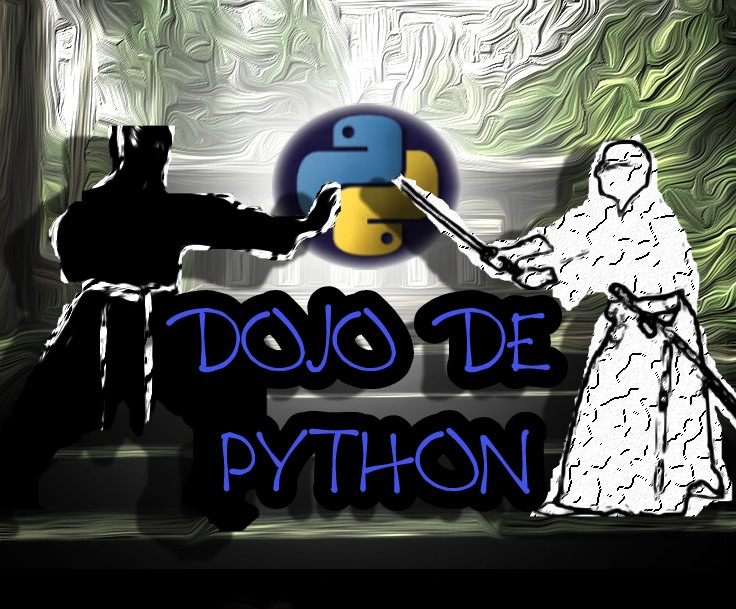

.. Python Flying Circus documentation master file, created by
   sphinx-quickstart on Mon Oct 24 19:44:10 2022.
   You can adapt this file completely to your liking, but it should at least
   contain the root `toctree` directive.

.. _ppfc:

**Sejam bem-vindos ao Dojo de Python. Encaram o desafio?**
====================================================

Nesta página há uma forma enigmática e desafiadora para treinar a programação em Python.
A proposta é desvendar os enigmas para seguir em frente. Python pode ajudá-los nesta missão!

Gostaria de tentar?
==================

Acesse o link abaixo:

.. toctree::
    :maxdepth: 1

    index.rst