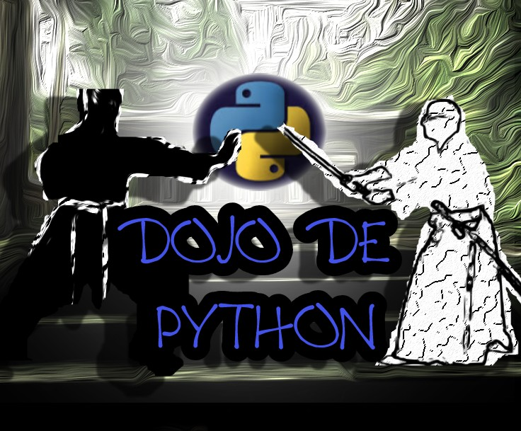

.. Python Flying Circus documentation master file, created by
   sphinx-quickstart on Mon Oct 24 19:44:10 2022.
   You can adapt this file completely to your liking, but it should at least
   contain the root `toctree` directive.

.. _desafio_1:

**Desafio 1**
==============

Nesta página há uma forma enigmática e desafiadora para treinar a programação em Python.
A proposta é desvendar os enigmas para seguir em frente. Python pode ajudá-los nesta missão!

Gostaria de tentar?
===================

Clique no link abaixo:

.. toctree::
    :maxdepth: 1

    desafio1.rst

.. note::
    Atenção ao texto e às imagens dos desafios. Use a IDE de sua preferência para fazer os scripts que desvendarão os enigmas. A resposta de cada um deles deve ser utilizada no endereço do navegador.